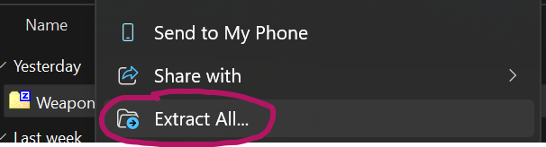
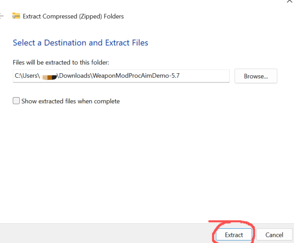

# Language
[English](README.md)
[Chinese](README_ZH.md)

# Need
This project requires plugin support:

Weapons Modification and Procedural Aiming：

https://www.fab.com/listings/f60a026a-39e9-4ee2-917d-7fa7ebe94c10

Supported UE5 versions are indicated by visible branches (for example, the 5.7 branch​ means it supports Unreal Engine 5.7).

# Related Links
### Demo Video:

https://www.youtube.com/watch?v=heHfPgHKp7g

### Demo Project:

### GitHub:
https://github.com/ProgrammingWu/WeaponModProcAimDemo

### Gitee:
https://gitee.com/programmingwu/WeaponModProcAimDemo

# Quick Start
## Download the Sample Project

After installing the WuWeaponModProcAim plugin, you can use the provided sample project to quickly understand how to integrate and use the plugin：

[Demo Project](#demo-project)
### GitHub
[GitHub Demo Project Link](#GitHub)

Switch to the branch that matches your Unreal Engine version (e.g., for UE 5.7, switch to the 5.7 branch)

then download the ZIP.

### Gitee
If you cannot access GitHub, you can also download from Gitee.

[Gitee Demo Project Link](#gitee)

You can switch to the branch that matches your Unreal Engine version. For example, for UE5 version 5.7, switch to the `5.7` branch.

Then click **Download ZIP**.

## Open the Sample Project
Right-click the downloaded ZIP file and select Extract All.

Navigate to the extracted folder and double-click the .uproject file to launch the project in Unreal Editor.

## Get Familiar with the Sample Project
### Verify Functionality
Open the demo level located at:
Content\Map\Map_Demo

Follow the on-screen instructions to test the features.

### Inspect Implementation
The Blueprints in this sample are relatively simple because the majority of the logic is encapsulated within the C++ plugin.

Most of the properties and functions exposed to Blueprints include detailed comments—some even explain the rationale behind their existence.

