# 语言
[English](README.md)
[中文](README_ZH.md)

# 需求
此项目需要插件支持：

Weapons Modification and Procedural Aiming：

https://www.fab.com/listings/f60a026a-39e9-4ee2-917d-7fa7ebe94c10

支持UE5版本可见分支（如5.7分支，就是支持UE5 5.7）。

# 相关链接
## 演示视频:

https://www.youtube.com/watch?v=heHfPgHKp7g

## 演示项目:

### GitHub:
https://github.com/ProgrammingWu/WeaponModProcAimDemo

### Gitee:
https://gitee.com/programmingwu/WeaponModProcAimDemo

# 快速开始
## 下载示例项目

安装好[Weapons Modification and Procedural Aiming](#需求)插件后。我额外提供了一个示例项目，帮助你快速理解插件使用方法：

[演示项目](#演示项目)

### GitHub
[GitHub演示项目链接](#GitHub)

可以切换到和你UE引擎版本一样的分支。比如UE5 5.7版本。切换到5.7分支

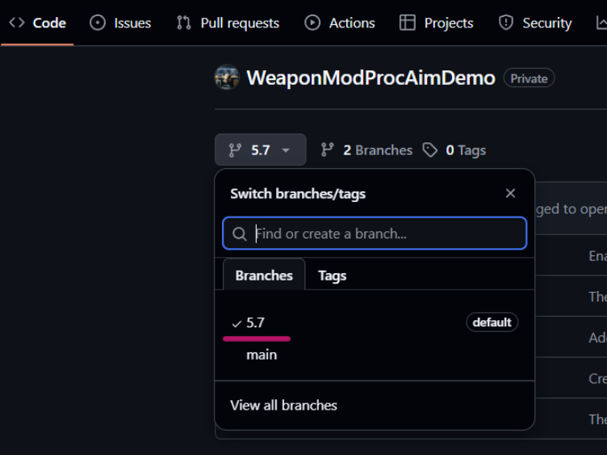

然后Download ZIP

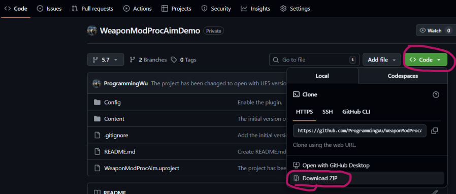

### Gitee
如果你无法链接GitHub，也可以从Gitee下载.

[Gitee演示项目链接](#gitee)

可以切换到和你UE引擎版本一样的分支。比如UE5 5.7版本。切换到5.7分支

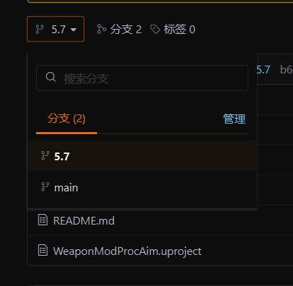

然后Download ZIP

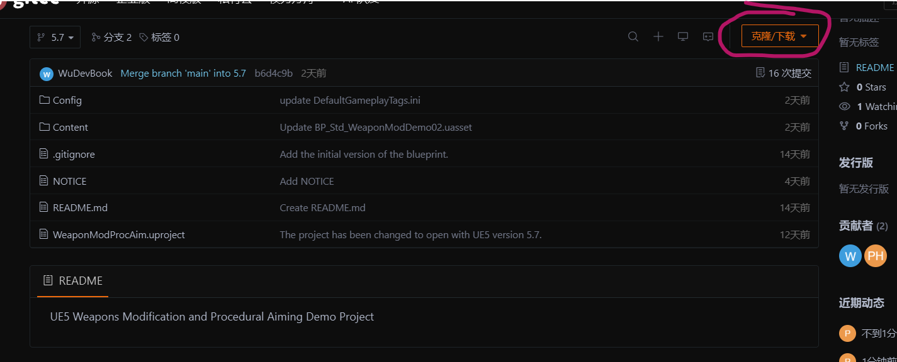

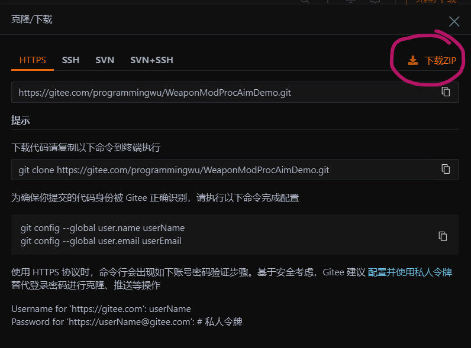

## 打开示例项目
鼠标右击，选择 全部解压缩 。

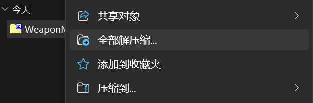

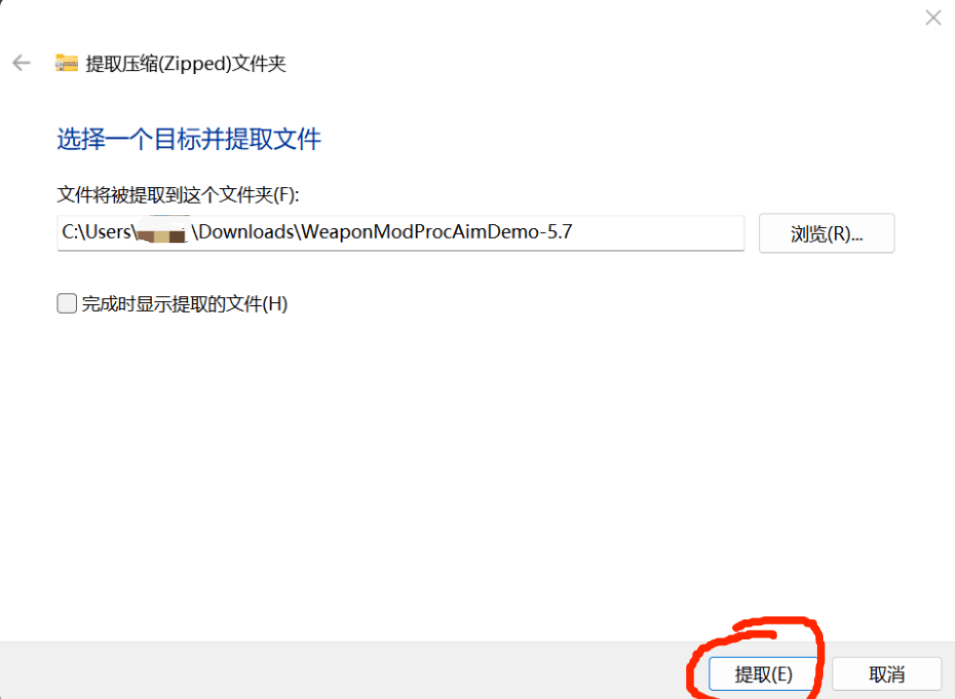

双击.uproject启动项目。

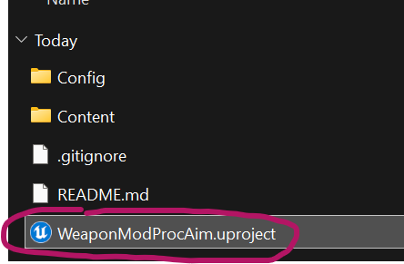

## 熟悉示例项目
### 检查功能
运行实例关卡

Content\Map\Map_Demo

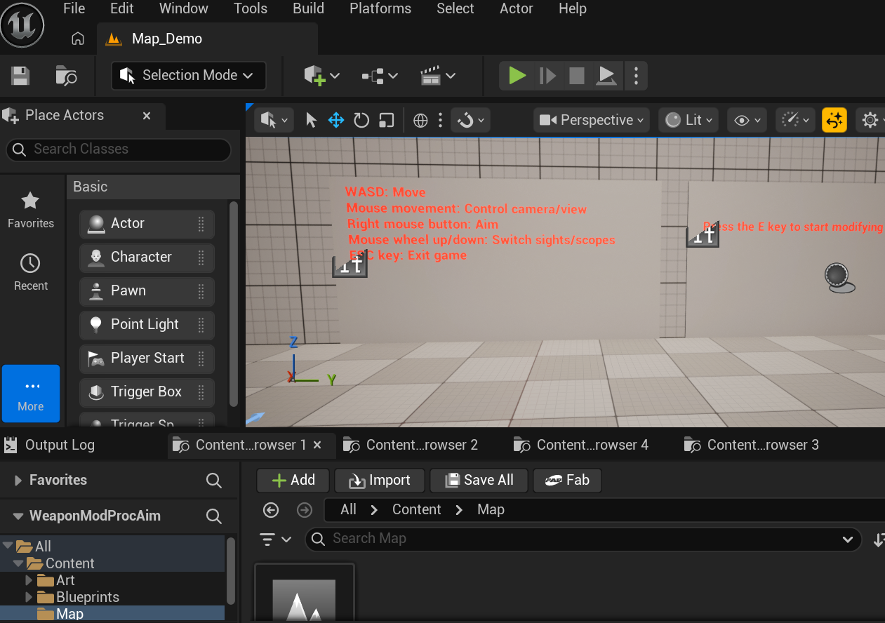

按提示进行操作

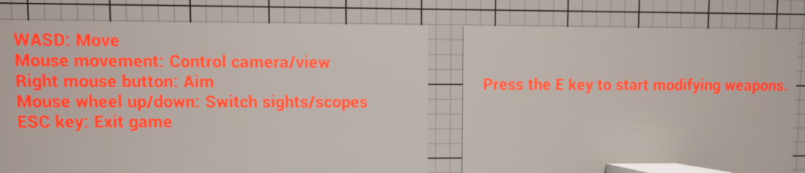

### 检查实现
示例蓝图都非常简单，因为绝大多数功能都使用C++封装到插件里了。

暴露给蓝图的属性/函数，大都有详细注释。部分还说明了为什么要有这个属性/函数：

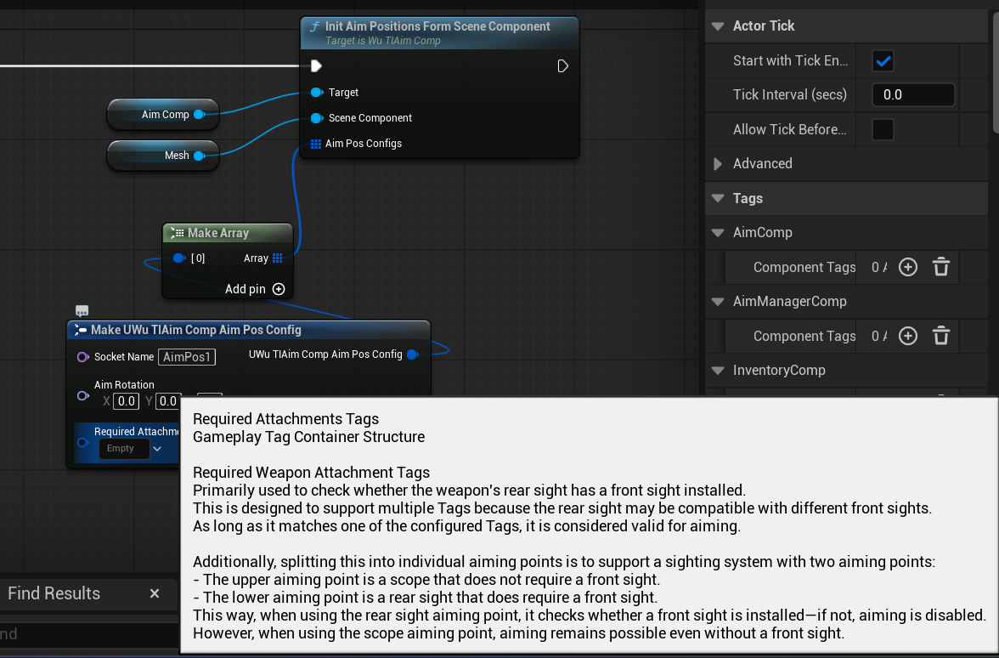